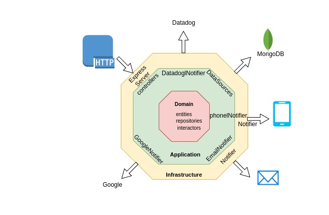

# Streamloots Card System

Card system with hexagonal Architecture

The code is divided in 3 main layers:

Core or Domain

- Entities: Business Objects
- Repositories: Interfaces to interact with the entities
- Interactors: Business logic, actions that the system can perform.

Application

- DataSources: Outputs of our system implementing repositories and connected to storage systems.
- Controllers: Inputs of our system encapsulating the transport layer. They should trigger the Interactors.
- EmailNotifier: Output of our systmen implementing NotifierRepository

Infrastructure:

- MongoDB: The system use respositories to connect with
- Email Server(gmail): The system use notifier to send the email
- Notification Server(firebase): The system use notifier to send the notification

## Getting started

- Clone the repo
  `git clone https://github.com/wooltar/streamloots`

- Install dependencies
  `npm install`

- Run mongo and mongoclient
  `docker-compose up`

- Start server
  `npm start`
